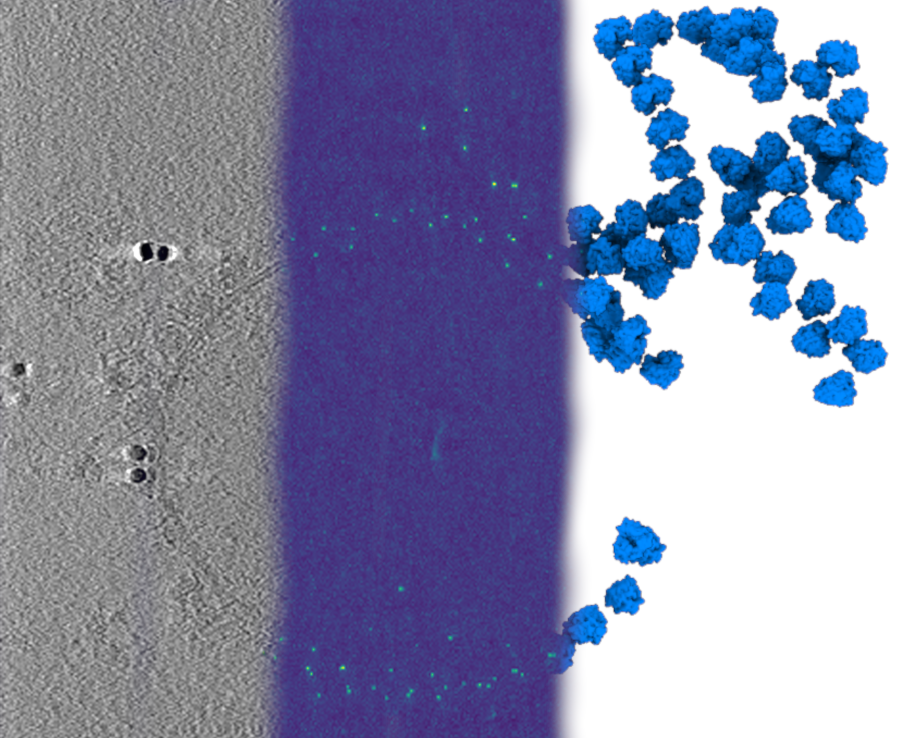

[](https://doi.org/10.5281/zenodo.10728422)


# pytom-match-pick: GPU template matching for cryo-ET

GPU template matching, originally developed in [PyTom](https://github.com/SBC-Utrecht/PyTom), as a standalone python package that can be run from the command line.



<!--
This line starts the block that is incorporated into the website via mkdocs snippets
-->
#--8<-- [start:docs]

## Requires

```
miniconda3
nvidia-cuda-toolkit
```

## Installation

There are 2 options for creating a conda environment. We recommend option (1) which will later allow cupy to build 
against a system installed cuda-toolkit. Compared to option (2) this can give an almost two-fold speedup:

1. **(recommended)** Create a new python 3 environment:

    ```commandline
    conda create -n pytom_tm python=3
    ```

2.  Create a new environment with a prebuild cupy version and complete CUDA-toolkit. This is more reliable, but takes more 
    disk space and has less optimal performance.

    ```commandline
    conda create -n pytom_tm -c conda-forge python=3 cupy cuda-version=11.8
    ```


Once the environment is created, activate it:

```commandline
conda activate pytom_tm
```

Then install the code with `pip` (building cupy can take a while!):

```commandline
python -m pip install pytom-match-pick[plotting]
```

The installation above also adds the optional dependencies `[matplotlib, seaborn]` which are required to run 
`pytom_estimate_roc.py`. They are not essential to the core template matching functionality, so for some systems 
(such as certain cluster environments) it might be desirable to skip them. In that case remove `[plotting]` from the pip install command:

```commandline
python -m pip install pytom-match-pick
```

## Cupy warning
Having issues running the software? If cupy is not correctly installed, 
```commandline
python -c "import pytom_tm"
```

can show a cupy warning. If this is the case, this probably means cupy is not correctly installed.
Alternatively, cupy can sometimes be installed without issue but not detect CUDA correctly. In that case, the following should raise some errors:
```commandline
python -c "import cupy as cp; a = cp.zeros((100,100))"
```

To solve cupy installation issues, please check 
[the cupy docs](https://docs.cupy.dev/en/stable/install.html#installing-cupy). It might be solved by installing a 
specific build compatible with the installed cuda toolkit.   

## Usage

Detailed usage instructions are available on the wiki: https://github.com/SBC-Utrecht/pytom-match-pick/wiki

Also, a tutorial can be found on the same wiki: https://github.com/SBC-Utrecht/pytom-match-pick/wiki/Tutorial

The following scripts are available to run with `--help` to see parameters:

- create a template from an mrc file containing a density map: `pytom_create_template.py --help`
- create a mask for template matching: `pytom_create_mask.py --help`
- run template matching with the mask (.mrc) and template (.mrc) on a tomogram (.mrc): `pytom_match_template.py --help`
- extract candidates from a job file (.json) created in the template matching output folder: `pytom_extract_candidate.py --help`
- estimate an ROC curve from a job file (.json): `pytom_estimate_roc.py --help`
- merge multiple star files to a single starfile: `pytom_merge_stars.py --help`

## Usage questions, ideas and solutions, engagement, etc
Please use our [github discussions](https://github.com/SBC-Utrecht/pytom-match-pick/discussions) for:
 - Asking questions about bottlenecks.
 - Share ideas and solutions.
 - Engage with other community members about processing strategies.
 - etc...

## Developer install
If you want the most up-to-date version of the code you can get install it from this repository via:

```commandline
git clone https://github.com/SBC-Utrecht/pytom-match-pick.git
cd pytom-match-pick
python -m pip install '.[all]'
```

if you don't want the optional plotting dependencies use the following install command instead:
```commandline
python -m pip install '.[dev]'
```

For development, please also install pre-commit to check and autostyle the code before 
you make PRs: 

```commandline
pre-commit install
```

This uses Ruff to check and format whenever you make commits. 

## Tests

With the developer install also comes the ability to run the unittests,
from the git repository run:

```commandline
cd tests
python -m unittest discover
```

## Contributing

Contributions to the project are very welcome! Feel free to make a pull request or suggest an implementation in the issues. For PR's we will gladly give you feedback on how to integrate the code.

## Citation

For a reference on GPU accelerated template matching in tomograms please see the [IJMS publication](https://www.mdpi.com/1422-0067/24/17/13375).


```
@Article{ijms241713375,
    AUTHOR = {Chaillet, Marten L. and van der Schot, Gijs and Gubins, Ilja and Roet, Sander and Veltkamp, Remco C. and Förster, Friedrich},
    TITLE = {Extensive Angular Sampling Enables the Sensitive Localization of Macromolecules in Electron Tomograms},
    JOURNAL = {International Journal of Molecular Sciences},
    VOLUME = {24},
    YEAR = {2023},
    NUMBER = {17},
    ARTICLE-NUMBER = {13375},
    URL = {https://www.mdpi.com/1422-0067/24/17/13375},
    ISSN = {1422-0067},
    DOI = {10.3390/ijms241713375}
}
```

<!--
This ends the block for the website
-->
# --8<-- [end:docs]
