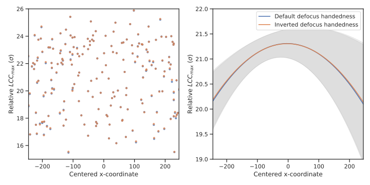

By Marten Chaillet ([@McHaillet](https://github.com/McHaillet)), August 2024. If you 
found these 
results useful, please cite our zenodo repository: 
[10.5281/zenodo.10728422](https://doi.org/10.5281/zenodo.10728422).

Although it has been shown multiple times that correcting defocus gradients is very 
important for subtomogram averaging in tilt-series data, the effects on particle 
localization have not been clearly illustrated (to my knowledge). The software Warp 
introduced a detailed correction of defocus gradients during template matching by 
splitting the tomogram into many small sub-boxes where the template can be corrected 
by tilt-dependent defocus offsets 
that adhere to the sample geometry. For an untilted image these 
offsets are a function of the z-coordinate in the tomogram, while for tilted image the 
defocus gradient is a function of both the x- and z-coordinate in the tomogram 
(assuming the 
tilt-axis is aligned with the y-axis). The defocus gradient are therefore expected 
to be the strongest for the images collected a high sample tilts. Considering that the 
resolution in tomograms is generally not considered to be high due to alignment errors 
and that the high tilt angles usually have an additional drop-off in resolution due to 
beam damage, I wondered how much effect defocus gradient correction actually has 
on the template matching scores. To test this in this benchmark, I here try to measure 
the defocus 
handedness of a tomogram.

## Approach

<figure markdown="span">
  { width="400" }
  <figcaption>Initial view of the data: annotations (turqoise sphere) made by 
pytom-match-pick on tomogram 27 of EMPIAR-10985.</figcaption>
</figure>

To properly measure the defocus handedness, I selected a dataset of isolated 
ribosomes in thin ice collected at a pixel size of 1.07 Å 
([EMPIAR-10985](https://www.ebi.ac.uk/empiar/EMPIAR-10985/); see figure above). Isolated macromolecules provide the highest 
resolution (contrary
to _in situ_ data). I used an approach, similar 
to Warp, 
that calculates the defocus offsets in each subvolume of a tomogram. To measure the 
effects of correcting for defocus gradients, I 
ran template matching assuming both a default and inverted defocus handedness of the 
tilt-series. This inverted handedness comes down to 
inverting the tilt angles during 
calculation of the defocus offsets. Either one of these two handedness' should be 
correct and hopefully influence the results sufficiently to see a difference. 

The defocus offsets are calculated as

```python
z_offset = z_coordinate * cos(tilt_angle) + x_coordinate * sin(tilt_angle) 
```

where `z_coordinate` and `x_coordinate` are the center of the subvolume relative to 
the center of the tomogram. A similar calculation could be applied for calculating 
the defocus offsets of a subtomogram centered on a particle in the dataset. The 
`z_offset` is then scaled to the correct units (μm).  

I do not apply phase flipping to the tilt series prior (or during) reconstruction, 
instead I modulate the template with oscillating CTF's that should match the CTF's 
of each tilt image.

The resolution of sampling defocus offsets is in this dataset primarily defined by the 
number of subvolumes along the x-axis of the tomogram. As the ice layer is very thin,
there will not be much variation along the z-axis. Therefore, I chose here to sample 
3 subvolumes along the x-axis. More subvolumes should improve the model of the 
defocus gradient, however, I assumed that this would be sufficient to measure a 
difference 
between regular and inverted defocus handedness. 

## Results

To assess the effects of the defocus handedness on the template matching scores, I 
analyzed the results as a function of the x-coordinate (see figure below). As the 
scores are normalized by the standard deviation (σ) during the full template matching 
search, it is of note that on average they are ~20 times σ. 

Looking at the expected false alarm rate compared to the background, gives a
better sense of the background separation. With a 
tomogram of size 510x720x74 and 248,400 rotations (angular increment of 3.9°), the 
full search space is 6,749,723,520,000. Calculating the σ cut-off of the background 
for a false alarm rate of 1 with the inverse complementary error function, 

```python
erfcinv(2 / search_space) * sqrt(2)
```

results in a cut-off of 7.30 σ. This indicates the ribosomes correlate well 
above the expected background noise, likely owing to the thin ice layer with isolated 
macromolecules.

<figure markdown="span">
  
  <figcaption>LCC<sub>max</sub> scores (normalized by the standard deviation from 
template matching) plotted as a function 
of the x-coordinate. In blue the results are shown that assumes the default defocus 
handedness, while orange shows the results of inverted defocus handedness. The left 
figure shows a scatter plot, while the right shows fitted quadratic functions to 
both sets of points. The gray areas indicate the 95% confidence interval of the fit.  
</figcaption>
</figure>

Looking at the effects of the defocus handedness, the scatter plot (left side 
of figure) seems to display a very minor effect of the defocus handedness on the 
normalized 
LCC<sub>max</sub> scores (download or open in new tab to zoom in). Around the center 
of the tomogram (x=0) the scattered points seems to overlap, which should be the 
case as the central subvolume does not have defocus offsets. Only on the left and 
right side of the plot, there appears a tiny increase in LCC<sub>max</sub> scores 
for the inverted defocus handedness. To better assess the effect, I fitted a quadratic 
function to both sets of 
LCC<sub>max</sub> scores as a function of the x-coordinate (right side of figure). 
This visualization makes it more easily discernible that there is an increase in 
LCC<sub>max</sub> values on both the left and right side for the inverted defocus 
handedness. (It is of note, that I had to adjust the y-axis limits on the right side 
to visualize this effect.) It appears the inverted defocus handedness is correct for 
this tilt-series. 

Small side note: _The inverted handedness seems to be the correct one. However, if the 
tilt-axis angle 
were set to 180 for AreTomo, the template would not need to be mirrored 
and (probably) neither the defocus handedness. I decided not to rerun 
this analysis with that setting as the point was to discern the effect of 
regular/inverted defocus handedness on the scores._

## Conclusion
Overall, the effects of defocus gradient correction seem minor. I attempted to 
measure the effect of defocus gradient correction by applying both a regular and 
inverted defocus handedness to subvolumes of tomograms during template matching. The 
tomogram used here has very high contrast due to a thin ice layer and isolated 
ribosomes. The images were additionally recorded at a pixel size of 1.07 Å. Template 
matching was performed at a voxel size of 8.56 Å, providing a maximal resolution of 
1/(17.12) Å<sup>-1</sup> in the tomogram which is generally considered a small pixel 
size for tomograms. As the effects of defocus handedness in this dataset 
were already difficult to discern, I expect the contribution of defocus gradient 
correction during template matching for _in situ_ datasets to be 
negligible.

## How-to-reproduce

### Requirements

* AreTomo 1.3 
* IMOD 4.11.24
* pytom-match-pick 0.7.2 (and should work with higher versions)

### Implementation of defocus gradient

An implementation for the defocus gradient calculation is available in our 
repository in `src/pytom_tm/TMJob.py`, see function 
`get_defocus_offsets()`. 

### Tilt series preprocessing

Download tilt-series 27 from [EMPIAR-10985](https://doi.org/10.6019/EMPIAR-10985):

* 9x9_ts_27_sort.mrc
* 9x9_ts_27_sort.mrc.mdoc
* 9x9_ts_27_sort_dose.txt

I put the data in the following directory structure:

```
empiar-10985/
+- raw_data/
¦  +- 9x9_ts_27_sort.mrc
¦  +- 9x9_ts_27_sort.mrc.mdoc
¦  +- 9x9_ts_27_sort_dose.txt
+- templates/
+- metadata/
+- tomogram/
+- tm_init/
+- tm_patch_def_reg/
+- tm_patch_def_inv/
```

Create a file with accumulated dose and a rawtlt file:

```commandline
grep '^TiltAngle' raw_data/9x9_ts_27_sort.mrc.mdoc | awk -F'=' '{print $2}' > metadata/9x9_ts_27_sort.rawtlt
```

```commandline
awk '{print $1}' raw_data/9x9_ts_27_sort_dose.txt > metadata/9x9_ts_27_sort_accumulated_dose.txt
```

Use AreTomo (1.3) to align and reconstruct the tilt-series. The .mdoc file does not specify a tilt-axis angle, so I let AreTomo find it.

```commandline
aretomo -InMrc raw_data/9x9_ts_27_sort.mrc -OutMrc tomogram/9x9_ts_27.mrc -AngFile metadata/9x9_ts_27_sort.rawtlt -AlignZ 400 -VolZ 600 -OutBin 8  -Gpu 0  -Wbp 1 -FlipVol 1
```

Fit ctf with IMOD; in the GUI select `fit each view separately` and then `autofit all 
views`. Tilt-axis angle is set to '-3.2323' as optimized by AreTomo (check the .aln file).

```commandline
ctfplotter -input raw_data/9x9_ts_27_sort.mrc -angleFn metadata/9x9_ts_27_sort.rawtlt -aAngle -3.2323 -defFn metadata/9x9_ts_27_sort.defocus -pixelSize 0.107 -volt 300 -cs 2.7  -expDef 3000 -range -60,60
```

### Creating a template and mask

I downloaded the subtomogram average [EMD-33115](https://www.ebi.ac.uk/emdb/EMD-33115) calculated for the EMPIAR dataset. NOTE: The reference is mirrored as I noticed in the first run without mirroring that the scores were unexpectedly poor. Mirroring fixes this issue.

```commandline
pytom_create_template.py -i templates/emd_33115.map -o templates/70S.mrc --output-voxel 8.56 -b 60 --invert --mirror
```

```commandline
pytom_create_mask.py -b 60 -o templates/mask.mrc --voxel-size 8.56 -r 14 -s 1
```

### Running template matching
(Optional) Run a simple job with low-pass to confirm if localization is working. Low-pass filtering reduces available resolution and therefore the angular search.

```commandline
pytom_match_template.py -t templates/70S.mrc -m templates/mask.mrc -v tomogram/9x9_ts_27.mrc -d tm_init --particle-diameter 250 -a metadata/9x9_ts_27_sort.rawtlt --per-tilt-weighting --voxel-size 8.56 --dose metadata/9x9_ts_27_sort_accumulated_dose.txt --defocus metadata/9x9_ts_27_sort.defocus  --amplitude 0.07 --spherical 2.7 --voltage 300 -g 0 --log debug --low-pass 30
```

```commandline
pytom_extract_candidates.py -j tm_init/9x9_ts_27_job.json -n 1000 -r 5 --cut-off 0.4
```

Run with default defocus handedness and a full rotation search. NOTE: defocus 
handedness is calculated for subvolumes so 
the `-s` option needs to be used to split the tomogram into multiple subvolumes. Only the splits along the x-axis influence the defocus values in this case as that is perpendicular to the tilt axis.

```commandline
pytom_match_template.py -t templates/70S.mrc -m templates/mask.mrc -v tomogram/9x9_ts_27.mrc -d tm_patch_def_reg --particle-diameter 250 -a metadata/9x9_ts_27_sort.rawtlt --per-tilt-weighting --voxel-size 8.56 --dose metadata/9x9_ts_27_sort_accumulated_dose.txt --defocus metadata/9x9_ts_27_sort.defocus  --amplitude 0.07 --spherical 2.7 --voltage 300 -g 0 -s 3 1 1 --defocus-handedness 1
```

```commandline
pytom_extract_candidates.py -j tm_patch_def_reg/9x9_ts_27_job.json -n 1000 -r 5 --cut-off 0.3
```

Run with inverted defocus handedness.

```commandline
pytom_match_template.py -t templates/70S.mrc -m templates/mask.mrc -v tomogram/9x9_ts_27.mrc -d tm_patch_def_inv --particle-diameter 250 -a metadata/9x9_ts_27_sort.rawtlt --per-tilt-weighting --voxel-size 8.56 --dose metadata/9x9_ts_27_sort_accumulated_dose.txt --defocus metadata/9x9_ts_27_sort.defocus  --amplitude 0.07 --spherical 2.7 --voltage 300 -g 0 -s 3 1 1 --defocus-handedness -1
```

```commandline
pytom_extract_candidates.py -j tm_patch_def_inv/9x9_ts_27_job.json -n 1000 -r 5 --cut-off 0.3
```

### Plotting the results

Our repository contains the file  
docs/benchmarks/defocus_gradient_analysis.ipynb that contains the exact code to 
reproduce the plots shown here. In brief:

* The notebook reads the starfiles containing the regular and inverted defocus 
  handedness template matching annotations.
* A check is made that the set of coordinates overlaps between the two jobs is the same.
* The results are plotted as x-coordinate versus the score (after normalizing by the 
  standard deviation).
* A quadratic curve is fit to both these sets of points to better visualize any 
  changes between them.

### (Optional) Visualization (with Blik)

Using Blik version 0.9.

```commandline
napari -w blik -- tm_patch_def_inv/9x9_ts_27_particles.star tomogram/9x9_ts_27.mrc
```

Then do the following steps:

* Set the `Slice thickness A` on the right to 40
* From the `Experiment` dropdown menu on the right select the tomogram
* Click in the center
* Then do `Ctrl + Y` to toggle 3D view
* Select the points layer (ends with `- particle positions`)
* In layer controls select the icon `Select points` 
* Do `Ctrl + A` and then set the `Point size` to 10
* Click in the center (not on a point) to deselect the points
* Press `Ctrl + Y` again to switch back to 2D view

Now you can scroll through the z-axis of the tomogram and the template matching 
annotations with the slider on the bottom.
