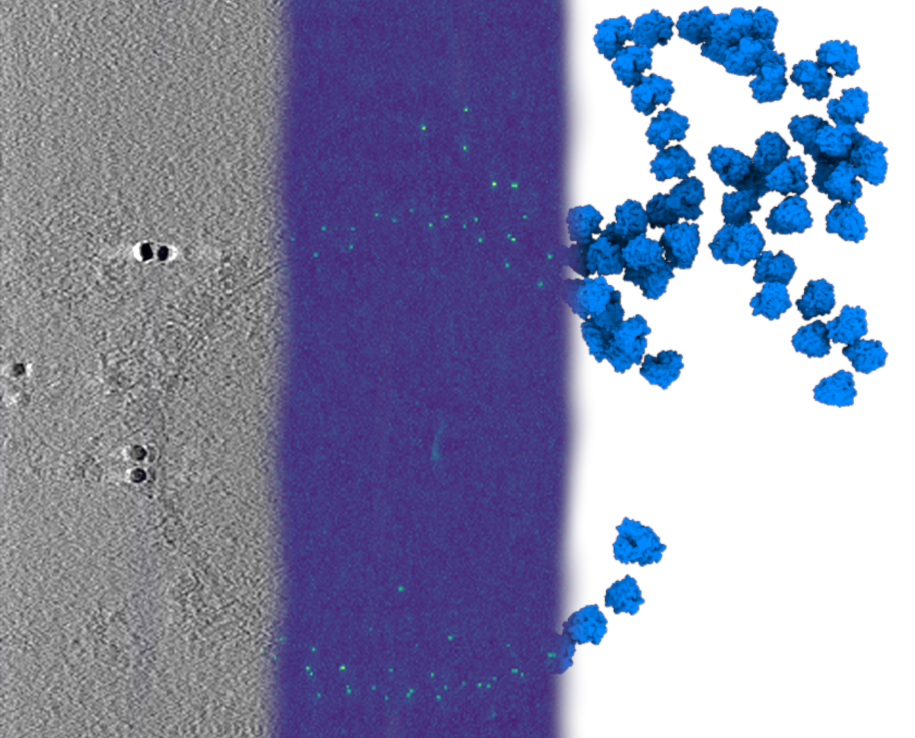

# pytom-match-pick: GPU template matching for cryo-ET

GPU template matching, originally developed in [PyTom](https://github.
com/SBC-Utrecht/PyTom), as a standalone python package that is run from the command 
line.

--8<-- "README.md:docs"
