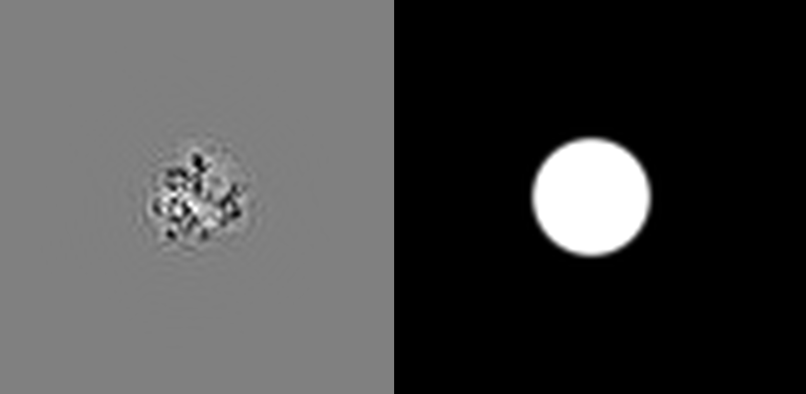
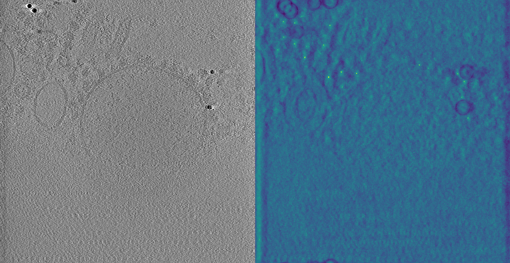
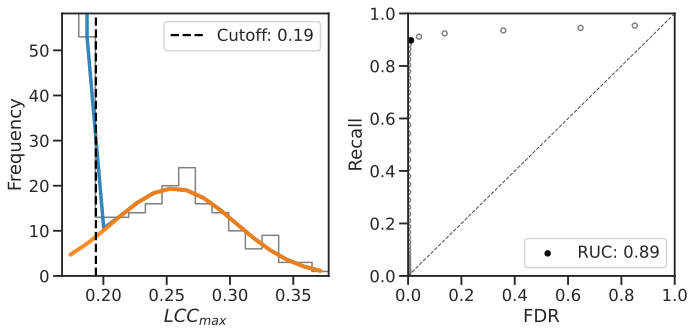
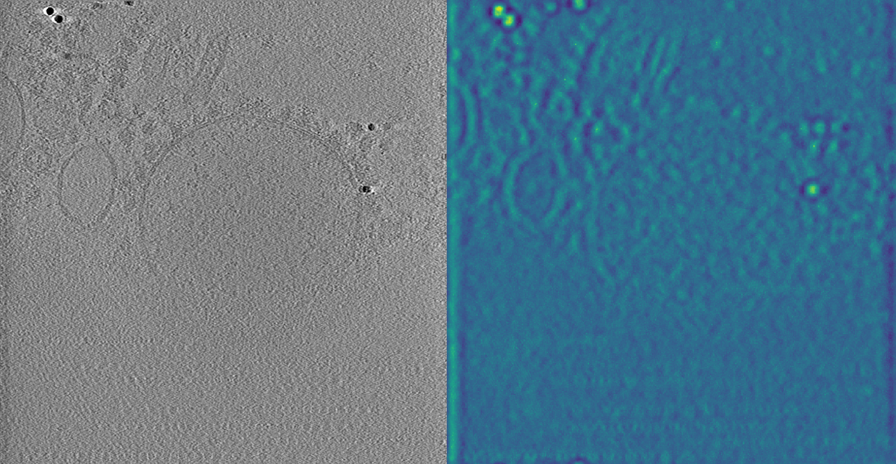
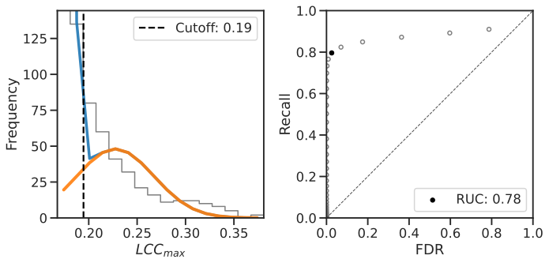

In this tutorial we are going to use template matching to detect human 80S ribosomes in a sample of ER-derived microsomes. As the tutorial dataset imaged isolated ER-derived vesicles with a 200 keV microscope, and the ice layer thickness is on the order of ~180 nm, the contrast is quite good. So, to make it more challenging, we are also going to test matching with only the 60S subunit. This way we can demonstrate some optimizations that can be made to maximize correlation. Besides, using [baited reconstruction](https://elifesciences.org/reviewed-preprints/90486) can also be a good way to prevent bias in the template search. 

## Preparing the dataset and template

The tutorial dataset can be downloaded from DataverseNL: <https://doi.org/10.34894/TLGJCM>. The raw tilt-series can also be found on DataverseNL: <https://doi.org/10.34894/OLYEFI>. Tilt-series were collected identically to [EMPIAR-11751](https://www.ebi.ac.uk/empiar/EMPIAR-11751/). A quick overview of the preprocessing workflow: (1) MotionCor2 was used to correct the motion in raw movie frames, (2) ctfplotter from IMOD was used to estimate defocus values, (3) ctfphaseflip from IMOD was used to do strip-based phaseflipping, and (4) AreTomo was used for reconstructing tomograms (weighted-back-projection) with 5x5 local patch alignment. Besides the tomograms (in MRC format), we provide for each tomogram a `.rawtlt` file with tilt angles, a `_dose.txt` file with accumulated dose per frame, and a `.defocus` file with per tilt defocus values.

We will initially use a cryo-EM reconstruction of the human 80S ribosome, which you will need to download from the EMDB: <https://www.emdataresource.org/EMD-2938>.

Secondly, we will use a PDB model of the human 80S ribosome, [6qzp](https://www.rcsb.org/structure/6QZP). To prepare the structure, first download the `.cif` file from the PDB. Then, the structure can be opened in ChimeraX and with the following command in the ChimeraX command line, a simple electrostatic potential model of the 60S large ribosomal subunit can be generated: 

```molmap #1/L? 5 gridSpacing 1.724```.

This means we sample the map on a 1.724 Å grid (which corresponds to the tilt-series' pixel size of this dataset) and at a resolution of 5 Å. `#1/L?` selects only chains starting with L from loaded model 1, i.e. chains that belong to the large subunit. Afterwards save the generated potential as an .mrc file: `6qzp_60S.mrc`. (It can also be downloaded [here](data/6qzp_60S.mrc))

Finally, we assume the following folder structure for this tutorial, with the current working directory `tm_tutorial` :

```
tm_tutorial/
+- dataset/
¦  +- tomo200528_100.mrc
¦  +- tomo200528_100.rawtlt
¦  +- tomo200528_100.defocus
¦  +- tomo200528_100_dose.txt
¦  +- tomo200528_101.mrc
¦  +- ...
+- templates/
¦  +- 6qzp_60S.mrc
¦  +- emd_2938.map
+- results_80S/
+- results_60S/
```

### Tomogram voxel size fix

I made the mistake to not annotate the voxel size in the tomograms correctly (thanks to @jinxsfe for pointing this out!). Please run the following command to fix the voxel size in the MRC headers:

``` bash
for x in dataset/.mrc; do python -c "import mrcfile; mrc = mrcfile.mmap('$x', 'r+'); mrc.voxel_size = 13.79"; done
```

## Part 1: Matching the 80S ribosome with a binary wedge and simple CTF

This section corresponds to the base method where the template is prepared by convolution with a single CTF and is adjusted with a binary wedge during the template matching run.

### Preparing the template and mask

Let's generate a template for the template matching run:

``` bash
pytom_create_template.py \
 -i templates/emd_2938.map \
 -o templates/80S.mrc \
 --input-voxel 1.1 \
 --output-voxel 13.79 \
 --center \
 --invert \
 -b 60
```

The `--ctf-correction` option convolutes the template with a single 3D-CTF with the specified defocus to roughly match the appearance of the particles in the tomograms. Even though each tilt-series will have different defocus values, for full ribosomes this is usually sufficient. The `--flip-phase` option takes the `absolute()` of the CTF before applying it. This is because the tomograms have been CTF-corrected which is done through phase-flipping. Since the `absolute()` operation makes all the values positive and our input map is white, we get back a white template. However, the tomograms of the dataset have black contrast (veryify by opening a tomogram), so finally the `--invert` flag needs to be set to make the template black.

Secondly, we need a mask with the same box size as the template and a radius that fully encompasses our ribosome structure. The diameter of a ribosome is roughly 300 Å, which means we need at least (300 Å / 13.79 Å =) 22 pixels to cover the ribosome. With some overhang we extend it to 24 pixels diameter, and therefore set the mask radius (`--radius`) to 12 pixels. The mask will also need a smooth fall-off to prevent aliasing artifacts, which we set with `--sigma`:

``` bash
pytom_create_mask.py \
 -b 60 \
 -o templates/mask.mrc \
 --voxel-size 13.79 \
 --radius 12 \
 --sigma 1
```

The `--voxel-size` is not really required for the mask, but in case you want to open the mask and template in ChimeraX (or napari) they are automatically scaled to the right size. If you have ChimeraX/napari/3dmod available its anyway a good idea to open the mask and template at this point to get a feel for the data. The mask should always be 1 in the center and 0 outside with a smooth fall-off. The template should have contrast matching your tomogram (i.e. black if the tomogram has black objects, and white vice versa).

<figure markdown="span">
  { width="400" }
  <figcaption>Template and mask slice</figcaption>
</figure>

The large template and mask box sizes might seem surprising, but they are needed for proper weighting during template matching. Similar to large box size during downstream high-resolution averaging, the overhang here also provides better sampling of weighting functions in Fourier space. The larger size increases the number of sampling points for CTFs and tomographic point spread functions.

### Running template matching

The template matching for the 80S ribosome can be started as follows:

``` bash
pytom_match_template.py \
 -t templates/80S.mrc \
 -m templates/mask.mrc \
 -v dataset/tomo200528_100.mrc \
 -d results_80S/ \
 --particle-diameter 300 \
 -a dataset/tomo200528_100.rawtlt \
 --low-pass 40 \
 --defocus 3 \
 --amplitude 0.08 \
 --spherical 2.7 \
 --voltage 200 \
 --tomogram-ctf-model phase-flip \
 -g 0
```

A low-pass filter of 40 Å is set to prevent bias. Then, the angular search is calculated from the Crowther criterion using a diameter $d$ of 300 Å and a $r_{max}$ of 1/(40 Å) (due to the low-pass filter), which results in a roughly 7° increment. Here, the program was started on the system GPU with index 0. If you have more GPU's available for the tutorial you can simply add them and pytom-match-pick will automatically distribute the angular search, e.g. `-g 0 1 2 3` will run on the first 4 GPU's in the system.

**Out of memory!** Although unlikely to happen during the tutorial, in later usage of the software your GPUs might run out of memory. This is especially likely for 4x or lower binned tomograms. If this happens, you can use the `--split` option to tile the tomogram into multiple sections. You need to specify the number of splits along each dimension, for example `--split 2 1 1` will split into 2 sections along the x-axis, `--split 2 2 1` will split once in x and once in y, resulting in 4 subvolumes!

To visualize the results it can be very informative to open the tomogram and score map side-by-side in Napari. Which should look like this:

<figure markdown="span">
  { width="800" }
  <figcaption>Slice 69 of dataset/tomo200528_100.mrc and results_80S/tomo200528_100_scores.mrc (in Napari)</figcaption>
</figure>

Then we calculate the receiver operator curve (ROC) to estimate true positives using:

``` bash
pytom_estimate_roc.py \
 -j results_80S/tomo200528_100_job.json \
 -n 800 \
 -r 8 \
 --bins 16 \
 --crop-plot  > results_80S/tomo200528_100_roc.log
```

This will automatically write a file to the folder where the job file is located (`tomo200528_100_roc.svg`). Additionally, here the terminal output is also written to the file `results_80S/tomo200528_100_roc.log` as it contains some info on the estimated number of particles in the sample. Catting the log file in the terminal (`cat results_80S/tomo200528_100_roc.log`), the estimated number of total true positives is approx. 180 ribosomes.

<figure markdown="span">
  { width="800" }
  <figcaption>ROC curve (results_80S/tomo200528_100_roc.svg)</figcaption>
</figure>

In this case the result is quite good: the Rectangle Under the Curve (RUC) is around 0.9 (1 is optimal). Also the fit of the gaussians seems very appropriate for the histogram, so we can use the estimated cut-off value (`0.194`) to extract particle coordinates and rotations into a STAR file: 

``` bash
pytom_extract_candidates.py -j results_80S/tomo200528_100_job.json -n 300 -r 8 -c 0.194
```

This will extract ~160 particles and save their annotations to the file `results_80S/tomo200528_100_particles.star`.

Alternatively, `pytom_extract_candidates.py` also has a default extraction cut-off estimation that can work well. Run the command without the `-c` parameter:

``` bash
pytom_extract_candidates.py -j results_80S/tomo200528_100_job.json -n 300 -r 8
```

It produces a very similar result: the script prints the estimated cut-off to the terminal (`0.197`) (very similar to the ROC estimated cut-off) and it also extracts ~160 particles. (Take care: the previous STAR file is overwritten.)

## Part 2: Matching the 60S ribosomal subunit with a tilt-weighted PSF

Now, let's apply the same base method using only the 60S subunit.

### Preparing the template and mask

The 60S template can be generated with this command:

``` bash
pytom_create_template.py \
 -i templates/6qzp_60S.mrc \
 -o templates/60S.mrc \
 --input-voxel 1.724 \
 --output-voxel 13.79 \
 --center \
 --invert \
 -b 60
```

For the mask the radius is slightly reduced to constrain it around the 60S subunit:

``` bash
pytom_create_mask.py \
 -b 60 \
 -o templates/mask_60S.mrc \
 --voxel-size 13.79 \
 --radius 10 \
 --sigma 1
```

### Running template matching

Template matching is run for the 60S subunit, where the low-pass filter is now set 
to 35 Å to include more high-resolution information in the template matching. This 
results in an angular sampling ~6.5°. We 
could also entirely remove it, but this would increase the sampling to 5.3°
which is less feasible for the tutorial. This potentially introduces more bias, 
however: with only the large subunit as a reference we can always test for detection 
of the small subunit in subtomogram averages.

The tilt-weighted PSF is also used here with the flag `--per-tilt-weighting` and by 
providing an IMOD-style defocus file (.defocus) and a text file dose accumulation. 
Furthermore, we run with `--random-phase-correction` to flatten the background noise 
using the method introduced by STOPGAP.

``` bash
pytom_match_template.py \
 -t templates/60S.mrc \
 -m templates/mask_60S.mrc \
 -v dataset/tomo200528_100.mrc \
 -d results_60S/ \
 --particle-diameter 300 \
 -a dataset/tomo200528_100.rawtlt \
 --per-tilt-weighting \
 --low-pass 35 \
 --defocus dataset/tomo200528_100.defocus \
 --amplitude 0.08 \
 --spherical 2.7 \
 --voltage 200 \
 --tomogram-ctf-model phase-flip \
 --dose-accumulation dataset/tomo200528_100_dose.txt \
 --random-phase \
 -g 0
```

Again, the slice and score map can be visualized in Napari:

<figure markdown="span">
  { width="800" }
  <figcaption>Slice 69 of dataset/tomo200528_100.mrc and results_60S/tomo200528_100_scores.mrc (in Napari)</figcaption>
</figure>

Matching only with the 60S subunit greatly reduces the peak height at the actual ribosome locations. Instead gold markers now start correlating heavily with the template and get higher values than the particles of interest. The reason is two-fold: (1) the size of the template has become smaller and (2) the switch from an EM-map to a PDB based model usually reduces correlation. The second point (2) can be caused by the electrostatic potential modelling with the simplistic molmap, which does not consider atom number and solvent embedding, but also because EM-maps might contain some additional heterogeneous densities.

The ROC curve is now estimated with: 

``` bash
pytom_estimate_roc.py \
 -j results_60S/tomo200528_100_job.json \
 -n 800 \
 -r 8 \
 --bins 16 \
 --crop-plot  > results_60S/tomo200528_100_roc.log
```

<figure markdown="span">
  { width="800" }
  <figcaption>ROC curve (results_60S/tomo200528_100_roc.svg)</figcaption>
</figure> 

The loss of quality is mainly visible from the gaussian fit (left plot). Even though the reported quality is still quite good (RUC), it is clear that the curve fit is not proper. This is due to the three mixed distributions that now appear: the left-most correctly fitted background noise (blue curve), the middle peak is from 60S subunits and the right-most peak from gold markers. The particle of interest and gold markers are both fitted as true positives (orange curve).

Sadly, gold markers (but also carbon film, and ice) can quite often interfere with 
template matching because of their high scattering potential leading to edges with very high signal-to-noise ratio (SNR). One way of dealing with this, is gold marker removal for which their are tools in IMOD, and also deep-learning based tools (e.g. [fidder](https://teamtomo.org/fidder/)), that remove gold markers on the tilt-image level before tomographic reconstruction. 

## Increasing the angular sampling

To improve the results, the angular sampling needs to be increased. For 
part 2 of this tutorial, we set the low-pass filter to 35 Å. This means template 
matching is now including resolution up to 1/(35 Å), 
which changes the required angular sampling to 6.5°. Running the template matching 
command from part 2 without a low-pass filter increases the angular increment to 5.3°.
This roughly doubles the runtime. For me, it takes 1h20m on one RTX3060. 

## Conclusion

We hope you enjoyed our tutorial on GPU-acculated template matching in 
cryo-ET! If you ran into any issues during the tutorial please let us know on our [github issues page](https://github.com/SBC-Utrecht/pytom-match-pick/issues). On this repository's [Discussions page](https://github.com/SBC-Utrecht/pytom-match-pick/discussions) you can also reach out with specific questions about running the software for your dataset, and find previous discussions.
